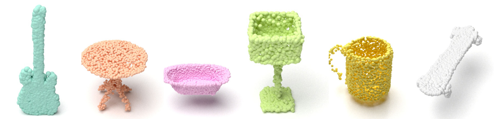
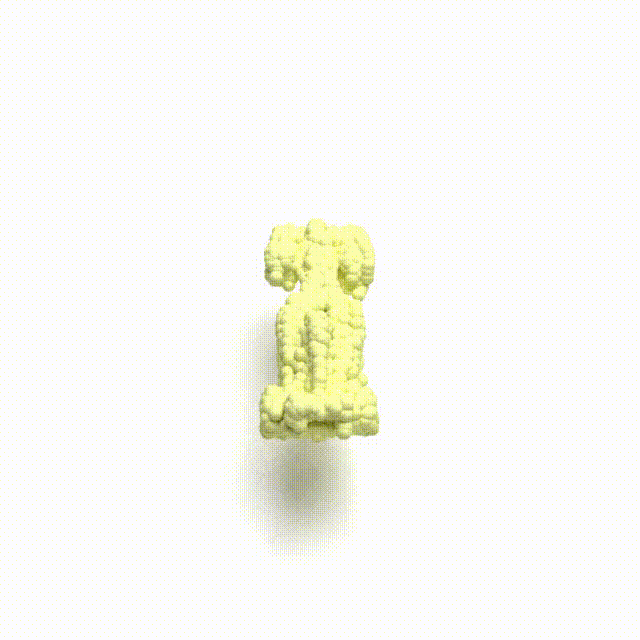
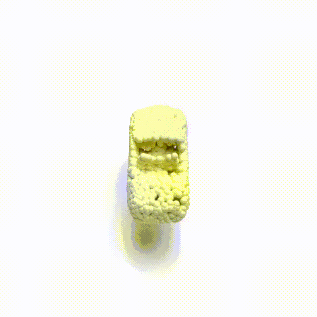
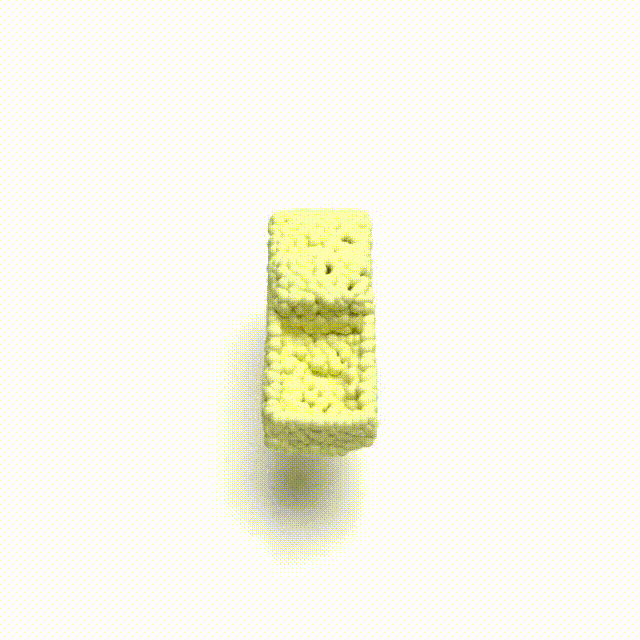
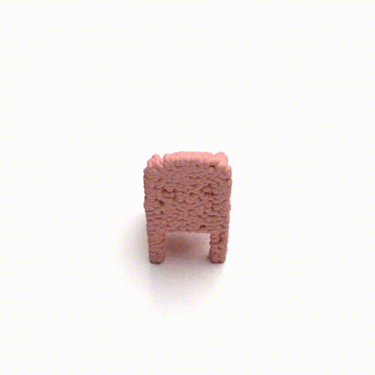
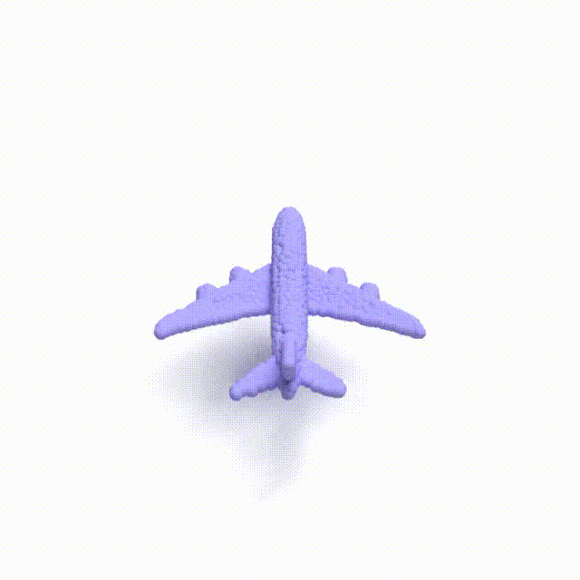
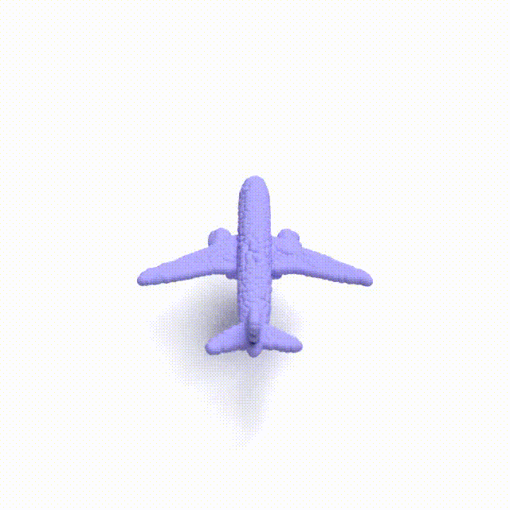
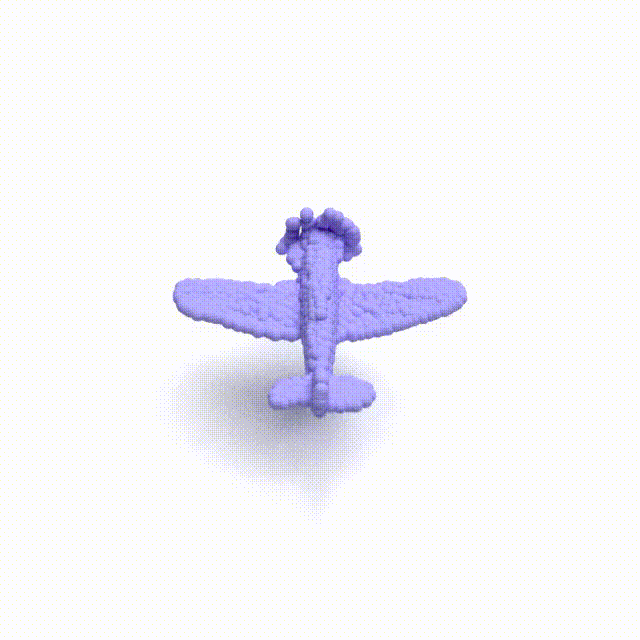
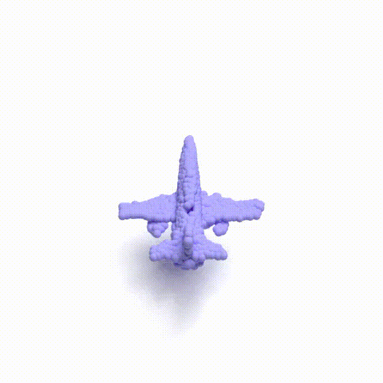

# Autoregressive 3D Shape Generation via Canonical Mapping
[[arxiv]](https://arxiv.org/abs/2204.01955)


<p float="middle">

  <!-- 
   
  
   -->
</p>
<!-- <p float="middle">
  
   
  
  
  <!-- 
   
  
   -->

Code release **WIP**:
- [x] Training/inference code
- [x] Installation and running instructions
- [x] Pre-trained checkpoints & generated samples
- [x] Evaluation using Jupyter notebook
- [ ] Cleanup

## Requirements
The code is developed and tested on Ubuntu 18.04, with python==3.8, CUDA==10.2.89, pytorch==1.10.0, pytorch_lightning==1.5.2.

By default, the Chamfer Loss module should work properly. If you failed to run the chamfer loss module, please see the following link and follow their instruction.
```setup
https://github.com/ThibaultGROUEIX/ChamferDistancePytorch
```

To install EMD Loss, please follow the instruction in [here](https://github.com/AnjieCheng/CanonicalPAE/tree/main/external/emd). 
```setup
cd external/emd
python setup.py install
```
The installed `build` folder should be under `external/emd`.

To install [StructuralLoss](https://github.com/stevenygd/PointFlow) for evaluation, please follow the instruction below.
```setup
cd external/metrics/pytorch_structural_losses/
make clean
make
```

## Dataset
We use the processed version of ShapeNet provided [PointFlow](https://github.com/stevenygd/PointFlow). Please download the dataset [here](https://drive.google.com/drive/folders/1G0rf-6HSHoTll6aH7voh-dXj6hCRhSAQ?usp=sharing).
Don't forget to change the `root` path in `src/data/core.py` to your dataset location.


## Train
To train the entire model from scratch, please follow these steps:
1. Pre-train the canonical mapping:
```
python main.py --base configs/base/airplane.yaml -t True --gpus 0,1,2,3 -n WHATEVER_NAME
```
2. Pre-train the grouping:
```
python main.py --base configs/stage1/128/airplane.yaml -t True --gpus 0,1,2,3 -n WHATEVER_NAME
```
3. Train the VQVAE:
```
python main.py --base configs/stage2/128/airplane.yaml -t True --gpus 0,1,2,3 -n WHATEVER_NAME
```
4. Train the Transformer:
```
python main.py --base configs/stage3/128/airplane.yaml -t True --gpus 0,1,2,3 -n WHATEVER_NAME
```
The checkpoint will be stored in the `log` directory, together with the tensorboard logger file and the generated samples. For each stage, please change the `ckpt_path` in the config file to the path of the checkpoints from last stage.

If you would like to start training from a certain stage, you can use the pre-trained checkpoints from this [link](https://drive.google.com/drive/folders/1NpSo8bBLR-vwOS5BK6pa6WRTnF1feuVl?usp=sharing) and use the `ignore_keys` in the config file to determine which module(s) to be trained from scratch.

## Evaluation
The pre-trained checkpoints and generated samples can be downloaded from this [link](https://drive.google.com/drive/folders/1NpSo8bBLR-vwOS5BK6pa6WRTnF1feuVl?usp=sharing). Please change the `ckpt_path` in `configs/stage3/128/*CATEGORY*_test.yaml` to either your trained checkpoints or or pre-trained checkpoints. Currently, the evaluation code only supports single GPU. If you use multiple GPUs, the code would still be runnable, but the calculated metrics may be incorrect.

```
python main.py --base configs/stage3/128/airplane_test.yaml -t False --gpus 0, -n airplan_test
python main.py --base configs/stage3/128/car_test.yaml -t False --gpus 0, -n car_test
python main.py --base configs/stage3/128/chair_test.yaml -t False --gpus 0, -n chair_test
```
The script will evaluate both auto-encoding performance and generation performance.

You can also directly evaluate the performance with our generated samples. Please download the samples from this [link](https://drive.google.com/drive/folders/1NpSo8bBLR-vwOS5BK6pa6WRTnF1feuVl?usp=sharing), and refer to `benchmark.ipynb` for details.

## Reference
Please cite our paper ([link](https://arxiv.org/abs/2204.01955)) 
in your publications if this repo helps your research:
```
@inproceedings{cheng2022autoregressive,
    title     = {Autoregressive 3D Shape Generation via Canonical Mapping},
    author    = {Cheng, An-Chieh and Li, Xueting and Liu, Sifei and Sun, Min and Yang, Ming-Hsuan},
    booktitle = {ECCV},
    year      = {2022}
}
```

## Acknowledgement
This repo is built on top of [VQ-GAN](https://github.com/CompVis/taming-transformers). We thank the authors for sharing the codebase!
